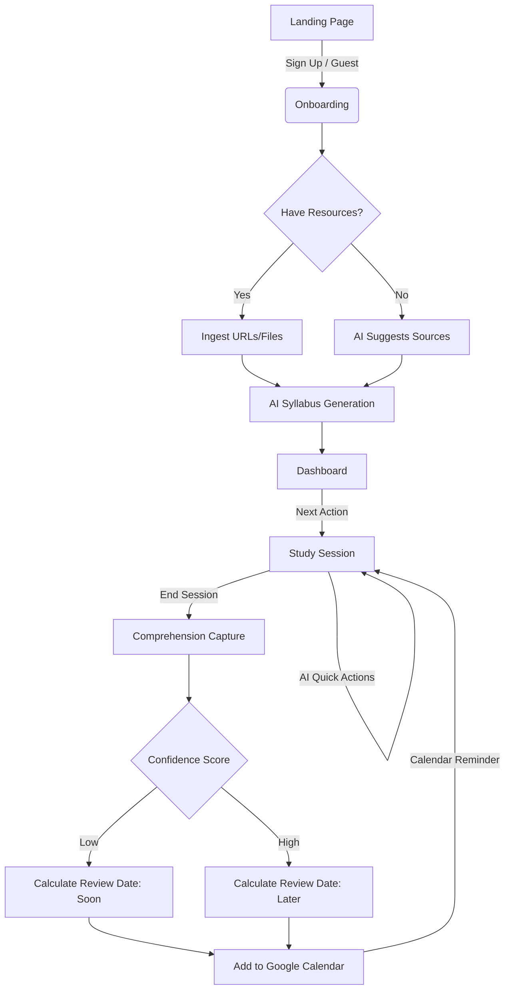

# Product Requirements Document: Learning Progress Architect

**Document Status:** Approved | **Version:** 2.0 | **Target Phase:** MVP to v1 Transition

---

## 1. Executive Summary & Vision

### 1.1 Product Vision
Learning Progress Architect is the default operating system for self-directed learning. We are building a private, AI-guided execution workspace that transforms ambiguous learning aspirations into concrete, momentum-driven reality. We believe that self-directed learners don't fail because they lack ambition; they fail because the operational burden of planning, finding resources, and maintaining discipline is too high. 

### 1.2 The "Elevator Pitch"
Learning Progress Architect sits at the intersection of a curriculum planner, an execution environment, and a spaced-repetition engine. It provides more structure than a blank notes app (like Obsidian/Notion) and exponentially more personalization than a rigid LMS (like Coursera). We turn a broad goal into a sequenced roadmap, guide the learner through focused study sessions, capture comprehension, and autonomously schedule reinforcement reviews—all while keeping the resulting knowledge universally portable via Markdown.

---

## 2. Problem Statement & Market Opportunity

### 2.1 The Core Problem
Motivated knowledge workers constantly attempt to upskill, but the failure rate of self-taught learning is astoundingly high. The friction is operational:
1. **The Blank Page Problem:** Deciding *what* to learn next consumes the energy needed *to* learn.
2. **The Context Switching Tax:** Jumping between YouTube, Notion, ChatGPT, and documentation breaks flow.
3. **The Illusion of Competence:** Passive reading feels like learning, but without structured reflection, retention drops off a cliff.
4. **The "Abandoned Project" Graveyard:** Without a system to resurface weak concepts, learners hit a wall and abandon the goal entirely.

### 2.2 Market Opportunity
The e-learning market is saturated with content providers. However, there is a massive gap in **execution software for learners**. The market provides the library, but no one is providing the compass. By focusing on the *workflow* of learning rather than hosting content, we can build a high-retention, high-engagement tool that acts as the user's personal academic director.

---

## 3. Target Audience & Personas

Our focus is squarely on the **Self-Directed Learner**. We are explicitly *not* building for teams, enterprises, or instructors in this phase.

### 3.1 Primary Persona: The Upskilling Engineer / Knowledge Worker
- **Demographics:** 25-45, working professional, tech-adjacent.
- **Psychographics:** Highly motivated, values their time, suffers from "tab overload," relies heavily on documentation and articles over long-form video courses.
- **Pain Point:** "I have 4 hours a week to learn this new framework. I spend 2 of those hours figuring out where I left off and what tutorial to read next."
- **Jobs to be Done (JTBD):** 
  - *When I* decide to learn a complex new domain, *help me* break it into a logical sequence *so I can* just sit down and execute without decision fatigue.

### 3.2 Secondary Persona: The Structured Hobbyist
- **Demographics:** Broad, learning for personal fulfillment or side-hustle.
- **Psychographics:** Dislikes rigid formal schooling but craves the momentum of a syllabus.
- **Pain Point:** Frequently starts ambitious projects but abandons them when the "honeymoon phase" of a new topic wears off.
- **Jobs to be Done (JTBD):** 
  - *When I* lose momentum, *show me* my progress and tell me exactly what small step to take today *so I don't* break my habit.

---

## 4. Product Principles

To ensure our product decisions align with our vision, all features must adhere to the following tenets:
1. **Next Action First:** Every major surface must clearly answer: "What is the highest-leverage thing I should do right now?" Information must never compete with execution.
2. **AI as an Accelerator, Not a Chatbot:** AI is kept tightly bounded within the workflow. It generates structure, explains concepts contextually, and sources materials. We do not want users "chatting"; we want them learning.
3. **Radical Portability:** The user owns their brain. Everything exports cleanly to Markdown. We lock users in through utility, not data silos.
4. **Opinionated by Default:** The software should make smart defaults (e.g., how to sequence a topic, when to review) to reduce cognitive load. 
5. **Calm Software:** The UI should reduce anxiety. No gamified badges for the sake of it, no aggressive push notifications. Just clarity and momentum.

---

## 5. Competitive Landscape & Positioning

| Competitor Category | Examples | Their Weakness | Our Advantage |
| :--- | :--- | :--- | :--- |
| **Note Apps** | Notion, Obsidian | Too blank. Requires the user to build the system before they can learn. | We bring the system. Zero setup required to get an actionable roadmap. |
| **Task Trackers** | Todoist, Asana | Built for projects, not pedagogy. No concept of "comprehension" or "review." | Built explicitly for knowledge acquisition and spaced reinforcement. |
| **LMS / Courses** | Coursera, Udemy | Rigid, one-size-fits-all. Pushes their content. | Completely personalized. Adapts to user's time, style, and chosen resources. |
| **Raw LLMs** | ChatGPT, Claude | High prompt burden. Forgets context. No durable state or schedule. | LLMs are embedded contextually. The product manages state, history, and scheduling. |

---

## 6. Core User Journeys

### Journey 1: The "Cold Start" (Onboarding & Planning)
1. User lands on the app and creates a goal: "Learn React Native."
2. User specifies constraints: "Beginner level, 4 hours/week, visual learner."
3. User decides on resources: "I don't have any, build me a plan."
4. **The Magic Moment:** In seconds, the AI generates a customized, 3-phase starter syllabus with actionable tasks and highly targeted search queries to find the best documentation. 

### Journey 2: The Focused Execution (Study Session)
1. User logs in. The Dashboard explicitly points to: *Next up: Understand React Component Lifecycle.*
2. User clicks "Start Session." A timer begins.
3. The UI presents the task objective and an AI-sourced reference link (e.g., React official docs).
4. While reading, the user gets confused by `useEffect`. They highlight their notes and click the "Explain via Analogy" Quick Action. The AI responds instantly, grounded in their specific goal context.

### Journey 3: The Reflection & Reinforcement (Comprehension)
1. User ends the timer.
2. A mandatory lightweight modal appears: "What did you learn? What blocked you? Rate your confidence (1-5)."
3. User submits. The system calculates a follow-up date based on the confidence score and provides an explicit "Add to Calendar" link to schedule the review directly in their Google Calendar.

---

## 7. Sitemap & Information Architecture

The architecture is designed to be flat, mobile-friendly, and execution-oriented.

- **`/` (Landing Page):** Value proposition, social proof, guest entry.
- **`/auth`:** Sign up, Log in, Password recovery.
- **`/onboarding`:** Goal parameter collection, resource ingestion, AI roadmap generation.
- **App Core (Authenticated):**
  - **`/dashboard`:** The operational hub. Active goal, next recommended action, high-level metrics.
  - **`/roadmap`:** The tactical view. Full sequence of tasks, status indicators.
  - **`/materials`:** Resource library. User-provided links and AI-suggested trusted sources.
  - **`/session/[id]`:** The deep work zone. Timer, task context, scratchpad, AI Quick Actions.
  - **`/session/[id]/reflect`:** Post-session comprehension capture.
  - **`/reviews`:** The reinforcement queue. Due-now vs. upcoming reviews.
  - **`/progress`:** The momentum view. Velocity, streak, confidence trends.
  - **`/reflections`:** Historical ledger of past session notes.
  - **`/settings`:** Markdown export engine, account management.

---

## 8. Functional Requirements (Epics & Features)

### Epic 1: Workflow Orchestration & Roadmap
- **Feature 1.1 Goal Definition:** Capture goal string, mastery level, time budget, target date, and learning modality.
- **Feature 1.2 Resource Ingestion:** Accept URLs, free-form text, or file drops to anchor the syllabus.
- **Feature 1.3 AI Syllabus Generation:** Generate sequenced tasks, study objectives, and search queries using generative AI, biased towards user resources if provided.
- **Feature 1.4 Fallback Generation:** Guarantee a functional baseline syllabus if external AI services degrade.

### Epic 2: The Study Environment
- **Feature 2.1 State Management:** Robust tracking of task states (Pending -> In Progress -> Completed -> Review Due).
- **Feature 2.2 Time Tracking:** Client-side session timer with pause/resume mechanics.
- **Feature 2.3 Contextual Quick Actions:** Pre-prompted AI helpers (`Explain`, `Give Example`, `Analogy`, `Clarify`) that are context-aware of the current task.
- **Feature 2.4 Persistent Scratchpad:** Auto-saving local notes during the session.

### Epic 3: Comprehension & Spaced Reinforcement
- **Feature 3.1 Post-Session Form:** Capture reflection notes, explicit blockers, and a 1-5 confidence score.
- **Feature 3.2 Dynamic Scheduling Algorithm:** Schedule review events based on the confidence score (e.g., low confidence = review tomorrow; high confidence = review in 7 days).
- **Feature 3.3 Explicit Calendar Egress:** Generate `.ics` or direct Google Calendar URL templates for blocking out study time, circumventing the need for heavy OAuth calendar scopes.

### Epic 4: Data Portability & Identity
- **Feature 4.1 Guest Mode Engine:** Frictionless instant access utilizing local storage/session states.
- **Feature 4.2 Account Persistence:** Seamless upgrade path from Guest to Registered user.
- **Feature 4.3 Markdown Export:** One-click compilation of all goals, roadmaps, notes, and reflections into clean, Obsidian/Notion-ready Markdown files.

---

## 9. Non-Functional Requirements

1. **Performance:** The "Time to First Action" (Login to starting a session) must be under 3 seconds. The UI must feel snappy and local-first.
2. **Reliability (Graceful Degradation):** The core loop (Start session -> take notes -> reflect) must function flawlessly even if the AI endpoints timeout or return 500s.
3. **Security & Privacy:** User study notes are strictly private. We do not train base models on user workspace data. Implement robust row-level security (RLS) in PostgreSQL.
4. **Responsiveness:** Navigation and the core study session must be 100% operable on mobile devices. Self-directed learners study on the train.

---

## 10. Success Metrics & KPIs

To measure whether we are solving the operational burden of learning, we will track the following:

**Primary Metric (OMTM):** 
- **Session Return Rate:** % of users who complete a second study session within 7 days of their first. (This proves they value the structure).

**Secondary Metrics:**
1. **Time-to-Value (TTV):** Time from signup to generating the first roadmap (Target: < 45 seconds).
2. **Completion Yield:** % of generated tasks that reach "Completed" status.
3. **Reflection Density:** % of completed sessions that have a written reflection (proves engagement with the comprehension mechanic).
4. **Review Compliance:** % of scheduled reviews that are actually completed when due.

---

## 11. Risks & Mitigations

| Risk | Impact | Mitigation Strategy |
| :--- | :--- | :--- |
| **AI Hallucinations in Roadmaps** | High | Keep generated roadmaps constrained (starter curriculums vs. full degrees). Heavily prompt AI to rely on trusted sources. Implement human-in-the-loop editing post-generation. |
| **API Cost Spikes** | Med | Cache repetitive Quick Action outputs. Limit roadmap generation retries per hour. |
| **User Abandonment Post-Setup** | High | The app cannot just be a planner. The Dashboard must aggressively push the user into the *Session* interface. Emphasize "Streak" and "Next Action" visually. |
| **Over-engineering the AI** | Med | Resist the urge to build an open-ended chatbot. Keep AI interactions restricted to bounded buttons (Quick Actions) to maintain product opinionation. |

---

## 12. Future Roadmap (Post-v1)

We are currently focused on v1 hardening. Our strategic horizon includes:

### Near-Term (Priority 2)
* **Enterprise-Grade AI Infrastructure:** Replace raw Gemini API keys with Google Cloud Vertex AI to ensure robust security, IAM compliance, and better rate limiting.
* **Intelligent Sourcing:** Expand the trusted-source grounding map. Filter out low-quality SEO spam and aggressively prioritize domains like `.edu`, `developer.mozilla.org`, and verified documentation hubs.
* **Hyper-Personalization:** Inject deeper user context into material suggestions. A senior engineer and a high school student learning Python should receive entirely different resource recommendations and AI analogies.
* **Managed Identity:** Migrate from local email/password mechanics to a robust managed identity provider (e.g., OAuth, OIDC) to reduce authentication friction.

### Mid-Term
* **Adaptive Roadmaps:** Move beyond the static 3-step starter plan. Allow the AI to dynamically insert prerequisite tasks if a user consistently reports low confidence during sessions.
* **Rich Notification Engine:** Email/Push reminders for overdue reviews to pull users back into the loop.

### Long-Term
* **Knowledge Graph Integration:** Connect disparate learning goals. (e.g., showing how the SQL goal completed last month connects to the Backend Engineering goal started today).
* **Curated Material Marketplaces:** Allow expert users to publish their roadmaps and validated resource lists for others to fork.
