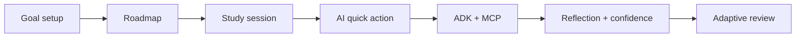
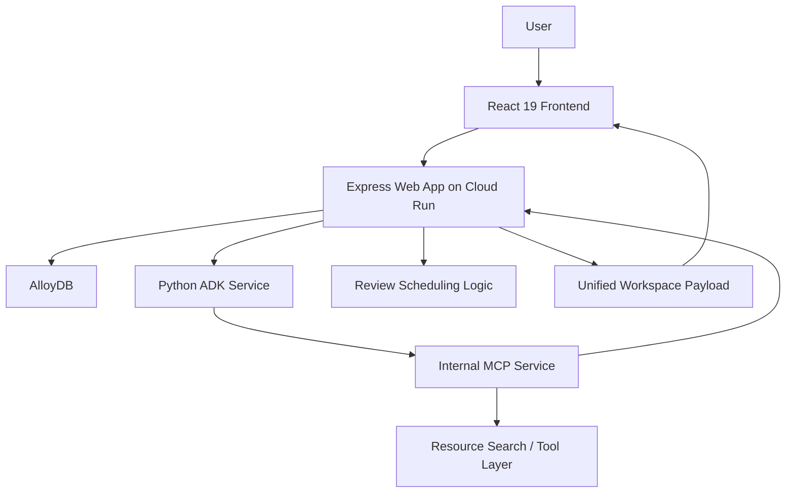

# Gen AI Academy Refinement Deck Content

This document reflects the polished, deployment-ready state of the system as of late April 2026. 

Current reality:
- The product is deployed to production on Cloud Run with a fully orchestrated `web -> ADK -> MCP` flow, with additional support for zero-configuration Vercel serverless deployment.
- Instant 1-Click Live Demo & Sandbox Mode (`/demo`) enabling instant evaluations with pre-seeded distributed systems curriculum, in-progress tasks, and cached quick actions.
- A highly polished, visually engaging UI with modern design patterns, interactive iconography, and a cohesive brand identity (Learning Progress Architect).
- Robust global developer attribution (Meet the Team modal).
- Complete user flow optimization, including comprehensive egress (back-to-home) navigation on all auxiliary views.
- Persistence is multi-provider driven by `AlloyDB` / PostgreSQL for production durability, with SQLite support for local and serverless execution.

Use the `Long Version` as speaker notes or a written submission. Use the `Short Version` as paste-ready slide copy.

## Slide 1. Participant Details

### Long Version

**Participant Name:** `Fadly Zaki` & `Vedo Alfarizi`

**Project Name:** `Learning Progress Architect`

**Problem Statement:**  
Self-directed learners often know what they want to achieve, but struggle to convert broad ambition into a realistic study plan, focused execution, and long-term retention. Most tools help with only one part of the journey, such as planning, note-taking, or task tracking. As a result, learners must manually stitch together their own system, which creates friction, inconsistency, and dropout.

### Short Version

**Participant Name:** `Fadly Zaki` & `Vedo Alfarizi`  
**Project Name:** `Learning Progress Architect`

**Problem Statement:**  
Learners often know what they want to study, but struggle to turn that goal into a practical plan, consistent learning sessions, and durable retention.

## Slide 2. Brief About The Idea

### Long Version

Learning Progress Architect is an AI-guided learning workspace that turns a vague learning goal into a structured roadmap, focused study sessions, contextual study support, and adaptive review loops.

The product is designed around the real learner workflow:
- define the goal
- set a realistic study pace
- generate a roadmap
- attach or discover learning resources
- study one task at a time
- get contextual help when blocked
- reflect on comprehension and confidence
- schedule reviews for reinforcement

The goal is not to replace the learner. The goal is to reduce the invisible operational burden around learning so the learner can focus on understanding, practice, and retention.

### Short Version

Learning Progress Architect turns a vague goal into a complete learning workflow:
- roadmap generation
- guided study sessions
- contextual AI help
- reflection and confidence capture
- adaptive review scheduling

## Slide 3. Solution Overview

### Long Version

We approached the problem by designing for the full study loop rather than for isolated productivity features, wrapped in a calm, highly-polished user interface.

The learner starts by entering a goal, current level, available study hours, preferred study style, and whether they already have materials. The system then creates a structured learning roadmap and connects each step with relevant resources so the learner can begin quickly.

During study sessions, the learner can trigger contextual quick actions such as `Explain`, `Example`, `Analogy`, and `I'm Confused`. In the live production architecture, the web app forwards these requests to a Python ADK service, which uses MCP tools to fetch task context, check cached responses, and persist new outputs. 

After the session, the learner records reflection, blockers, and confidence. That confidence signal then drives review scheduling so weaker topics return earlier and stronger topics return later.

### Short Version

The solution supports the full learning loop:
- capture goal and study constraints
- generate a roadmap
- attach or discover resources
- study with contextual AI help
- reflect after the session
- adapt review timing based on confidence

## Slide 4. Opportunities / USP

### Long Version

Most learning tools only solve one layer of the problem:
- planning
- note storage
- flashcards
- quizzes
- generic AI chat

Our solution is different because it connects planning, execution, clarification, reflection, and review into one continuous, aesthetically refined system.

Key differentiators:
- workflow-native AI instead of a separate chat-only assistant
- roadmap generation that considers goal, level, pace, and study style
- support for both learner-provided and system-suggested resources
- contextual in-session AI support powered by ADK and MCP
- cached quick-action outputs for continuity and lower repeated cost
- confidence-based review timing that turns reflection into retention
- **Live production deployment:** Not just a local concept, but a polished, secure, publicly accessible Cloud Run application with high-fidelity visual identity.

### Short Version

**USP**
- not just planning, not just chat, not just notes
- one connected workflow from goal to retention
- ADK + MCP powered contextual study support
- confidence-based review timing
- Live Cloud Run production environment with premium UI

## Slide 5. List Of Features Offered By The Solution

### Long Version

- 1-Click Instant Live Demo Sandbox (`/demo`) and Guest Mode
- Email and password authentication with a secure, guided flow
- Guided onboarding for goal, level, pace, target date, and study style
- AI-assisted roadmap generation with deterministic fallback
- Support for learner-supplied materials such as docs, videos, books, and notes
- Suggested resources for each task
- Dashboard with active goal, next task, and progress snapshot
- Roadmap view with sequenced study tasks
- Session page with timer, objective, and linked materials
- In-session AI quick actions routed through ADK
- MCP-backed task-context lookup and quick-action persistence
- Quick-action caching for repeated study needs
- Reflection, blocker logging, and confidence capture
- Confidence-based review scheduling
- Zero-friction, client-side Google Calendar template generation with direct session deep links (`/app/session/:taskId`)
- Reviews page for due and upcoming revision work
- Progress page for study time, streak, and Markdown export
- Reflections page for reviewing past learning notes
- Global interactive "Meet the Team" developer attribution modal
- English and Indonesian interface support

### Short Version

- 1-Click Instant Live Demo & Guest Sandbox
- Guided onboarding & AI roadmap generation
- Resource attachment and suggestion
- Focused study sessions with ADK-routed quick actions
- MCP-backed context and persistence
- Zero-friction Google Calendar deep-link integration
- Reflection and confidence capture
- Adaptive reviews & historical progress
- Multi-lingual (EN/ID) premium interface

## Slide 6. Process Flow Diagram / Use-Case Diagram

### Long Version

```mermaid
flowchart LR
    A["Learner defines goal and pace"] --> B["System creates roadmap"]
    B --> C["Tasks are paired with resources"]
    C --> D["Learner starts a focused study session"]
    D --> E["Learner requests contextual help"]
    E --> F["Web app calls ADK service"]
    F --> G["ADK uses MCP tools for context and persistence"]
    G --> H["Learner receives explanation, example, analogy, or recovery help"]
    H --> I["Learner records reflection and confidence"]
    I --> J["System schedules the next review"]
```

Use-case explanation:
- The learner creates a study workspace
- The learner defines the target skill and time budget
- The system generates an initial plan
- The learner studies one task at a time
- If stuck, the learner triggers contextual AI help
- ADK handles orchestration and MCP handles trusted reads and writes
- The learner records understanding and blockers
- The system adjusts review timing based on confidence

### Short Version

## Slide 7. Wireframes / Mock Diagrams Of The Proposed Solution

### Long Version

Recommended screenshot sequence from the live production app:
- `Landing Page`
  Showcasing the premium dark-mode UI, rich iconography, social proof, and value proposition.
- `Onboarding`
  Goal, pace, preferred style, and resource mode selection.
- `Dashboard`
  Current goal, next best task, and progress snapshot.
- `Roadmap`
  Sequenced learning tasks clearly laid out.
- `Session Page`
  Timer, objective, resources, and quick actions.
- `Quick Action Output`
  Contextual explanation or analogy response directly embedded in the workflow.
- `Reflection / Review View`
  Reflection, blockers, confidence, and scheduled follow-up.

Caption:
The interface has been thoroughly refined to feel premium and trustworthy. It reduces cognitive load by narrowing the learner's focus to the next meaningful step, while AI appears only where it directly supports learning progress.

### Short Version

Recommended screens:
- Icon-rich Landing page
- Onboarding flow
- Dashboard & Roadmap
- Session page
- Quick action output
- Reflection and reviews

## Slide 8. Architecture Diagram Of The Proposed Solution

### Long Version

Architecture explanation:
- `React 19` frontend for an incredibly fast and resilient SPA experience.
- `Express` web app as the only public API.
- `Python ADK service` for workflow and study-coach orchestration.
- `Internal MCP service` for trusted task context, cache lookup, resource search, and persistence operations.
- `AlloyDB` as the highly available, production-grade cloud storage layer, providing robust data durability.
- Graceful runtime behavior with strict fetch timeouts (30s ADK, 15s MCP internal) and deterministic fallback content when AI quota is constrained.
- All external service calls are timeout-bounded to prevent cascading failures.
- Live Cloud Run demo path: `web -> ADK -> MCP`

### Short Version

Architecture:
- React 19 Frontend
- Express public backend
- Python ADK orchestration layer
- Internal MCP tool layer
- AlloyDB persistence
- Cloud Run deployment with `web -> ADK -> MCP`

## Slide 9. Technologies / Google Services Used In The Solution

### Long Version

**Core technologies**
- React 19
- React Router 7
- Vite
- TypeScript
- Express
- AlloyDB & SQLite Multi-Provider Architecture
- Tailwind CSS 4
- Vercel Serverless Function Substrate

**Google and AI services**
- Cloud Run for the live multi-service production deployment
- Cloud Build for container image builds
- Gemini for generated roadmap and study-support content
- Python ADK service for orchestration
- MCP server for trusted tool execution and context access

**Why this stack was chosen**
- React and Vite support fast, high-quality product iteration.
- Express keeps the public API stable and performant.
- ADK cleanly separates orchestration from the public app.
- MCP separates reasoning from trusted data access.
- AlloyDB ensures scalable and durable persistence across cloud instances.
- Cloud Run and Vercel provide scalable, zero-ops bridges from prototype to production.

### Short Version

Technologies used:
- React 19, TypeScript, Express, Tailwind CSS 4
- AlloyDB & SQLite
- Cloud Run, Cloud Build & Vercel
- Gemini
- Python ADK
- MCP

## Slide 10. Snapshots Of The Prototype

### Long Version

Recommended screenshots:
- **Landing Page:** Highlight the cohesive branding, "Trusted by Autodidacts" section, and new iconography.
- **Onboarding:** Show the frictionless, step-by-step intake process.
- **Session Screen:** Show the core study loop and ADK quick actions in action.
- **Global Context:** Show the Meet the Team modal for developer attribution.

Suggested caption:
The refined prototype proves that generative AI can be integrated into a premium, consumer-grade workflow. The system supports the entire learning loop seamlessly—from roadmap creation and contextual quick actions via ADK + MCP to reflection and review scheduling—all presented in a beautiful, highly polished UI.

### Short Version

Prototype snapshots should show:
- Premium Landing Page
- Onboarding
- Session support
- Quick actions
- Global developer context

## Slide 11. Closing / Future Roadmap

### Long Version

The refined prototype proves that generative AI can be embedded into a learning workflow in a way that feels practical, supportive, and grounded in real study behavior, wrapped in a premium consumer-grade interface.

What is already proven:
- Complete learning workflow deployed to Cloud Run.
- ADK + MCP orchestration operating flawlessly in the live demo.
- Contextual study support inside the learning session.
- High-fidelity visual design, interactive elements, and robust navigation.
- Production-grade persistence via AlloyDB.

Next steps:
- Add AlloyDB AI for retrieval and memory enrichment.
- Improve roadmap depth beyond the current three-step structure.
- Strengthen service-to-service security from shared token auth toward IAM-based identity.

Closing line:
Learning Progress Architect does not replace the learner. It removes the friction around planning, studying, and reviewing—presented in a beautifully simple interface—so learners can stay focused, recover faster when confused, and retain more of what they study.

### Short Version

Current prototype proves:
- Premium consumer-grade UI
- Live ADK + MCP architecture
- Complete learning workflow
- Useful contextual study support
- AlloyDB persistence
- Hardened service resilience (timeouts, error states, race-condition guards)

Next steps:
- AlloyDB AI integration
- Deeper retrieval and memory
- IAM-based service identity
