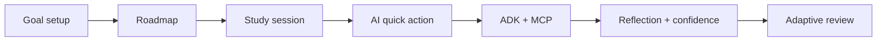
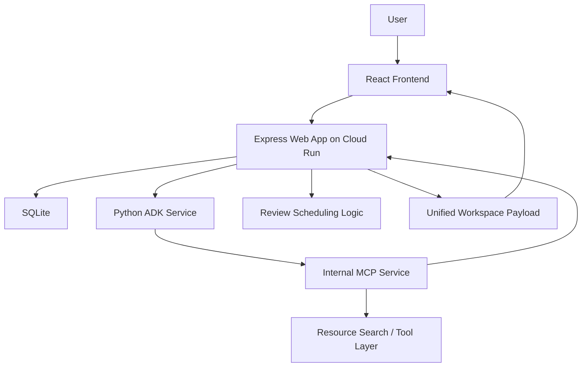

# Gen AI Academy Prototype Deck Content

This draft reflects the current live demo system as of April 8, 2026.

Current reality:
- The prototype is deployed on Cloud Run with a `web -> ADK -> MCP` flow.
- `ADK` and `MCP` are implemented in the live demo architecture.
- The public web app remains the single user-facing entry point.
- Persistence is still `SQLite`, so `AlloyDB` and `AlloyDB AI` remain the next infrastructure step.
- When Gemini quota is constrained, the system now degrades into deterministic, context-aware fallback content instead of failing completely.

Use the `Long Version` as speaker notes or a written submission. Use the `Short Version` as paste-ready slide copy.

## Slide 1. Participant Details

### Long Version

**Participant Name:** `Fadly Zaki`

**Project Name:** `The Autodidact Project | Learning Progress Architect`

**Problem Statement:**  
Self-directed learners often know what they want to achieve, but struggle to convert broad ambition into a realistic study plan, focused execution, and long-term retention. Most tools help with only one part of the journey, such as planning, note-taking, or task tracking. As a result, learners must manually stitch together their own system, which creates friction, inconsistency, and dropout.

### Short Version

**Participant Name:** `Fadly Zaki`  
**Project Name:** `The Autodidact Project | Learning Progress Architect`

**Problem Statement:**  
Learners often know what they want to study, but struggle to turn that goal into a practical plan, consistent learning sessions, and durable retention.

## Slide 2. Brief About The Idea

### Long Version

Learning Progress Architect is an AI-guided learning workspace that turns a vague learning goal into a structured roadmap, focused study sessions, contextual study support, and adaptive review loops.

The product is designed around the real learner workflow:
- define the goal
- set a realistic study pace
- generate a roadmap
- attach or discover learning resources
- study one task at a time
- get contextual help when blocked
- reflect on comprehension and confidence
- schedule reviews for reinforcement

The goal is not to replace the learner. The goal is to reduce the invisible operational burden around learning so the learner can focus on understanding, practice, and retention.

### Short Version

Learning Progress Architect turns a vague goal into a complete learning workflow:
- roadmap generation
- guided study sessions
- contextual AI help
- reflection and confidence capture
- adaptive review scheduling

## Slide 3. Solution Overview

### Long Version

We approached the problem by designing for the full study loop rather than for isolated productivity features.

The learner starts by entering a goal, current level, available study hours, preferred study style, and whether they already have materials. The system then creates a three-step learning roadmap and connects each step with relevant resources so the learner can begin quickly.

During study sessions, the learner can trigger contextual quick actions such as `Explain`, `Example`, `Analogy`, and `I'm Confused`. In the current live architecture, the web app forwards these requests to a Python ADK service, which uses MCP tools to fetch task context, check cached responses, and persist new outputs.

After the session, the learner records reflection, blockers, and confidence. That confidence signal then drives review scheduling so weaker topics return earlier and stronger topics return later.

This makes the product useful for self-directed learners, students, and working professionals who need a calmer and more reliable path from intention to retained knowledge.

### Short Version

The solution supports the full learning loop:
- capture goal and study constraints
- generate a roadmap
- attach or discover resources
- study with contextual AI help
- reflect after the session
- adapt review timing based on confidence

## Slide 4. Opportunities / USP

### Long Version

Most learning tools only solve one layer of the problem:
- planning
- note storage
- flashcards
- quizzes
- generic AI chat

Our solution is different because it connects planning, execution, clarification, reflection, and review into one continuous system.

Key differentiators:
- workflow-native AI instead of a separate chat-only assistant
- roadmap generation that considers goal, level, pace, and study style
- support for both learner-provided and system-suggested resources
- contextual in-session AI support powered by ADK and MCP
- cached quick-action outputs for continuity and lower repeated cost
- confidence-based review timing that turns reflection into retention
- cloud-deployed demo architecture that already runs beyond localhost

### Short Version

**USP**
- not just planning, not just chat, not just notes
- one connected workflow from goal to retention
- ADK + MCP powered contextual study support
- confidence-based review timing
- live Cloud Run demo, not only a local prototype

## Slide 5. List Of Features Offered By The Solution

### Long Version

- Email and password authentication
- Guided onboarding for goal, level, pace, target date, and study style
- AI-assisted roadmap generation with deterministic fallback
- Support for learner-supplied materials such as docs, videos, books, and notes
- Suggested resources for each task
- Dashboard with active goal, next task, and progress summary
- Roadmap view with sequenced study tasks
- Session page with timer, objective, and linked materials
- In-session AI quick actions routed through ADK
- MCP-backed task-context lookup and quick-action persistence
- Quick-action caching for repeated study needs
- Reflection, blocker logging, and confidence capture
- Confidence-based review scheduling
- Reviews page for due and upcoming revision work
- Progress page for study time, streak, and completion visibility
- Reflections page for reviewing past learning notes
- English and Indonesian interface support

### Short Version

- Guided onboarding
- AI roadmap generation
- Resource attachment and suggestion
- Focused study sessions
- ADK-routed quick actions
- MCP-backed context and persistence
- Reflection and confidence capture
- Adaptive reviews
- Progress and reflections history

## Slide 6. Process Flow Diagram / Use-Case Diagram

### Long Version

```mermaid
flowchart LR
    A["Learner defines goal and pace"] --> B["System creates roadmap"]
    B --> C["Tasks are paired with resources"]
    C --> D["Learner starts a focused study session"]
    D --> E["Learner requests contextual help"]
    E --> F["Web app calls ADK service"]
    F --> G["ADK uses MCP tools for context and persistence"]
    G --> H["Learner receives explanation, example, analogy, or recovery help"]
    H --> I["Learner records reflection and confidence"]
    I --> J["System schedules the next review"]
```

Use-case explanation:
- The learner creates a study workspace
- The learner defines the target skill and time budget
- The system generates an initial plan
- The learner studies one task at a time
- If stuck, the learner triggers contextual AI help
- ADK handles orchestration and MCP handles trusted reads and writes
- The learner records understanding and blockers
- The system adjusts review timing based on confidence

### Short Version

## Slide 7. Wireframes / Mock Diagrams Of The Proposed Solution

### Long Version

Recommended screenshot sequence:
- `Landing Page`
  Value proposition and calm learning framing
- `Onboarding`
  Goal, pace, preferred style, and resource mode
- `Dashboard`
  Current goal, next best task, and progress snapshot
- `Roadmap`
  Sequenced learning tasks
- `Session Page`
  Timer, objective, resources, and quick actions
- `Quick Action Output`
  Contextual explanation or analogy response
- `Reflection / Review View`
  Reflection, blockers, confidence, and scheduled follow-up

Caption:
The interface is designed to reduce cognitive load. Each screen narrows the learner's focus to the next meaningful step, while AI appears only where it directly supports learning progress.

### Short Version

Recommended screens:
- Landing page
- Onboarding
- Dashboard
- Roadmap
- Session page
- Quick action output
- Reflection and reviews

## Slide 8. Architecture Diagram Of The Proposed Solution

### Long Version

Architecture explanation:
- `React` frontend for onboarding, dashboard, roadmap, sessions, reviews, and reflections
- `Express` web app as the only public API and SPA host
- `Python ADK service` for workflow and study-coach orchestration
- `Internal MCP service` for trusted task context, cache lookup, resource search, and persistence operations
- `SQLite` as the current prototype storage layer
- graceful runtime behavior where the system can still return useful fallback content when Gemini quota is constrained
- live Cloud Run demo path: `web -> ADK -> MCP`

### Short Version

Architecture:
- React frontend
- Express public backend
- Python ADK orchestration layer
- Internal MCP tool layer
- SQLite persistence
- Cloud Run deployment with `web -> ADK -> MCP`

## Slide 9. Technologies / Google Services Used In The Solution

### Long Version

**Core technologies**
- React 19
- React Router 7
- Vite
- TypeScript
- Express
- SQLite with `better-sqlite3`
- Tailwind CSS 4

**Google and AI services**
- Cloud Run for the live multi-service demo deployment
- Cloud Build for container image builds
- Gemini for generated roadmap and study-support content when quota is available
- Python ADK service for orchestration
- MCP server for trusted tool execution and context access

**Why this stack was chosen**
- React and Vite support fast product iteration
- Express keeps the public API stable
- ADK cleanly separates orchestration from the public app
- MCP separates reasoning from trusted data access
- SQLite keeps the prototype lightweight and easy to run
- Cloud Run provides a realistic bridge from local prototype to cloud-hosted demo

**Honest positioning**
This version already implements ADK and MCP in the deployed demo stack. What is still not final is the data layer: the prototype still uses SQLite, while AlloyDB and AlloyDB AI are the next step for durable multi-user scale and richer retrieval.

### Short Version

Technologies used:
- React, TypeScript, Express
- SQLite
- Cloud Run
- Cloud Build
- Gemini
- Python ADK
- MCP

## Slide 10. Snapshots Of The Prototype

### Long Version

Recommended screenshots:
- Landing page
- Onboarding
- Dashboard
- Roadmap
- Session screen
- Quick action response
- Review screen
- Progress screen

Suggested caption:
The prototype already demonstrates an end-to-end learning loop:
- roadmap creation
- resource-guided study
- contextual quick actions
- ADK + MCP orchestration
- reflection and confidence capture
- adaptive review scheduling
- progress visibility over time

This makes the solution more than a concept deck. It is already a working cloud demo.

### Short Version

Prototype snapshots should show:
- onboarding
- roadmap
- session support
- quick actions
- reviews
- progress

## Slide 11. Closing / Future Roadmap

### Long Version

The current prototype proves that generative AI can be embedded into a learning workflow in a way that feels practical, supportive, and grounded in real study behavior.

What is already proven:
- cloud-hosted end-to-end workflow
- ADK + MCP orchestration in the live demo
- contextual study support inside the learning session
- graceful fallback when model quota is constrained

Next steps:
- replace SQLite with AlloyDB for durable shared persistence
- add AlloyDB AI for retrieval and memory enrichment
- improve roadmap depth beyond the current three-step structure
- strengthen service-to-service security from shared token auth toward IAM-based identity
- improve review intelligence and retention modeling
- mature from demo deployment into true multi-user production architecture

Closing line:
Learning Progress Architect does not replace the learner. It removes the friction around planning, studying, and reviewing so learners can stay focused, recover faster when confused, and retain more of what they study.

### Short Version

Current prototype proves:
- live ADK + MCP architecture
- complete learning workflow
- useful contextual study support

Next steps:
- AlloyDB
- AlloyDB AI
- deeper retrieval and memory
- stronger production hardening
