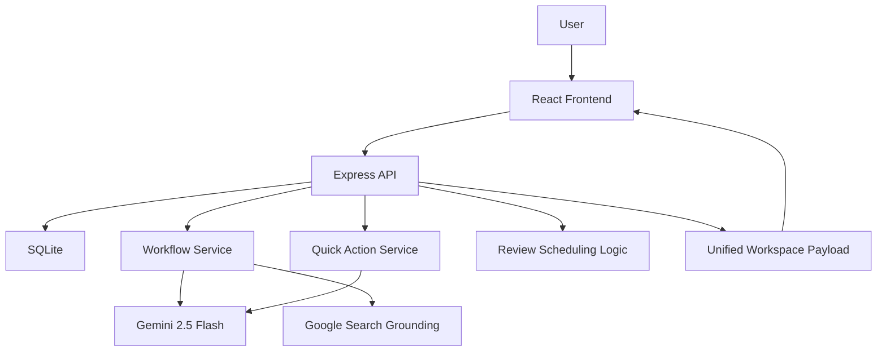

# Gen AI Academy Prototype Deck Content

This version reflects the current codebase after the latest production changes, including the new Gemini-powered quick actions inside study sessions.

Important positioning note: the deck template mentions `ADK`, `MCP`, and `AlloyDB AI`, but this prototype currently ships with `Gemini 2.5 Flash`, Google Search grounding, `Express`, and `SQLite`. The copy below is written to stay accurate to the implemented product while still framing a credible future roadmap.

## Slide 1. Participant Details

**Participant Name:** `Fadly Zaki`

**Project Name:** `The Autodidact Project | Learning Progress Architect`

**Problem Statement:**  
Self-directed learners often know what they want to achieve, but struggle to convert broad goals into a realistic study plan, consistent day-to-day action, and durable retention. Most tools only help with planning, note-taking, or task tracking in isolation. This creates cognitive overload, fragmented workflows, and weak feedback loops.

## Slide 2. Brief About The Idea

Learning Progress Architect is an AI-guided learning workspace that transforms a vague learning goal into a structured roadmap, focused study sessions, contextual AI assistance, and adaptive review loops.

The system is designed for learners who need more than a to-do list. It supports the full study workflow:

- define a learning goal
- set a realistic weekly pace
- generate a roadmap
- attach or discover study materials
- run a focused study session
- ask for in-session AI help when blocked
- capture reflection and confidence
- schedule reviews based on learning strength

The main idea is to reduce cognitive drag. Instead of forcing learners to build and manage their own study system, the product holds the structure for them.

## Slide 3. Solution Overview

### Paste-ready version

We approached the problem by designing around the actual learning loop rather than around isolated productivity features.

The learner starts by describing a goal, current level, weekly time budget, preferred study style, and whether they already have learning materials. The system then generates a three-step roadmap using Gemini-backed planning with a deterministic fallback path when AI is unavailable. Each task is paired with suggested resources so the learner can begin immediately.

During study sessions, the learner is not left alone with a timer. The product now includes in-session quick actions powered by Gemini, such as "Explain Simply", "Give an Example", "Use an Analogy", and "I'm Confused". These actions use the current task, goal, and attached resources as context, and the responses are stored so they can be reused later without repeating the same AI call.

After the session, the learner records what they understood, where they got stuck, and how confident they feel. That confidence signal drives review scheduling, so difficult topics return sooner and stronger topics are spaced further out.

This creates practical value for self-directed learners, university students, and working professionals who need a calmer, more reliable path from intention to retained knowledge.

### Shorter slide version

Learning Progress Architect turns a vague goal into a complete learning workflow:

- AI-assisted roadmap generation
- grounded study resource suggestions
- guided study sessions
- on-demand contextual AI support
- reflection and confidence capture
- adaptive review scheduling

## Slide 4. Opportunities / USP

### How different is it from existing ideas?

Most learning tools focus on only one layer of the problem:

- planning the curriculum
- storing notes or content
- tracking tasks
- delivering quizzes

Our solution is different because it connects planning, studying, clarification, reflection, and review into one continuous workflow. It is not just a planner and not just an AI chatbot. It is a study operating system designed to support the learner at the exact moments where friction usually causes drop-off.

### USP of the proposed solution

- Calm, workflow-native AI instead of noisy standalone chat
- Personalized roadmap based on goal, level, pace, and study style
- Supports both learner-provided resources and system-suggested resources
- In-session Gemini quick actions for explanation, example, analogy, and confusion recovery
- Cached AI outputs reduce repeated calls and improve continuity
- Confidence-based review timing turns reflection into retention
- One product flow from onboarding to progress tracking

## Slide 5. List Of Features Offered By The Solution

- Email and password authentication
- Guided onboarding for goal, level, weekly hours, target date, and learning style
- AI-assisted roadmap generation with deterministic fallback
- Support for learner-supplied resources such as docs, books, videos, and notes
- Grounded learning resource suggestions for each task
- Dashboard with next recommended task and active goal progress
- Roadmap page with task-by-task sequencing
- Session page with timer, objectives, and linked materials
- Gemini-powered quick actions inside the session
- Persisted quick action responses for later reuse
- Comprehension capture after every study session
- Reflection and blocker logging
- Confidence-based review scheduling
- Reviews page for due and upcoming revision work
- Progress page with study time, streak, task completion, and confidence metrics
- Reflections page for reviewing prior session notes
- Bilingual interface support in English and Indonesian

## Slide 6. Process Flow Diagram / Use-Case Diagram

### Suggested content

```mermaid
flowchart LR
    A["Learner defines goal and study pace"] --> B["System generates roadmap"]
    B --> C["Tasks are enriched with resources"]
    C --> D["Learner starts a focused session"]
    D --> E["Learner can trigger Gemini quick actions for help"]
    E --> F["Learner records reflection, blockers, confidence"]
    F --> G["System schedules next review"]
    G --> H["Learner returns to weak areas at the right time"]
```

### Use-case explanation

- The learner creates a personal learning workspace
- The learner defines what to learn and how much time is available
- The system generates a structured roadmap
- The learner studies one task at a time
- If the learner gets stuck, the system provides contextual AI help
- The learner records understanding and blockers
- The system adapts review timing using confidence
- The learner tracks long-term progress and reflection history

## Slide 7. Wireframes / Mock Diagrams Of The Proposed Solution

### Recommended screen sequence

Use screenshots from the current prototype in this order:

- `Landing Page`
  Product value and calm learning philosophy
- `Onboarding`
  Goal, pace, study style, and resource mode setup
- `Dashboard`
  Current goal, next focus, plan summary, and progress signal
- `Session Page`
  Timer, study objective, resources, and quick action panel
- `Quick Action Modal`
  Generated explanation or analogy for the current task
- `Comprehension + Reviews`
  Reflection, blockers, confidence score, and review queue

### Caption text

The UI is designed to keep the learner focused on the next meaningful step. Instead of exposing too many decisions at once, each screen narrows the workflow and surfaces AI only when it directly supports learning.

## Slide 8. Architecture Diagram Of The Proposed Solution

### Suggested content

### Architecture explanation

- Frontend: React SPA for onboarding, dashboard, roadmap, sessions, reviews, progress, and reflections
- Backend: Express service for auth, workflow generation, task progression, quick actions, and data APIs
- Persistence: SQLite stores users, tasks, study sessions, resources, reviews, and quick action outputs
- AI planning layer: Gemini creates roadmap tasks and enriches them with grounded learning resources
- AI support layer: Gemini quick actions generate contextual explanations during live study sessions
- Review engine: confidence scores determine how soon a learner should revisit material
- Read model: the frontend consumes a unified workspace payload, including persisted quick actions

## Slide 9. Technologies / Google Services Used In The Solution

### Paste-ready content

**Core technologies**

- React 19
- React Router 7
- Vite
- TypeScript
- Express
- SQLite with `better-sqlite3`
- Tailwind CSS 4

**Google and AI services**

- Gemini 2.5 Flash via `@google/genai`
- Google Search grounding for resource discovery
- Cloud Run deployment path through Docker and Makefile setup

**Why this stack was chosen**

- React and Vite enable rapid iteration across a multi-step product experience
- Express keeps the backend orchestration simple and easy to evolve
- SQLite reduces operational overhead for an MVP while still supporting a full end-to-end workflow
- Gemini 2.5 Flash is fast enough for roadmap generation and in-session study assistance
- Google Search grounding helps connect generated tasks with real learning resources
- The deployment setup creates a path from local MVP to a hosted cloud demo

### Honest Q&A positioning

This version does not yet implement ADK, MCP, or AlloyDB AI in the shipped code. A natural next step would be to evolve the current workflow and quick-action services into a richer agent architecture and move persistence from SQLite to a cloud-native database for multi-user scale.

## Slide 10. Snapshots Of The Prototype

### Recommended screenshots

- Landing page hero
- Onboarding flow
- Dashboard
- Study session screen
- Quick action modal output
- Comprehension page
- Reviews page
- Progress page

### Suggested caption block

The prototype already demonstrates a complete learning loop:

- roadmap creation
- resource-guided study
- live contextual AI support
- reflection and confidence capture
- adaptive review scheduling
- progress visibility over time

This makes the solution more than a concept. It is already a functional end-to-end prototype.

## Slide 11. Closing / Future Roadmap

The current prototype proves that generative AI can be embedded into a learning workflow in a way that feels supportive, practical, and grounded in real study behavior.

### Next steps

- expand from single-user MVP to multi-user cloud deployment
- support richer roadmap generation beyond a fixed three-task plan
- improve review intelligence with stronger spaced-repetition behavior
- add longitudinal mastery analytics and weak-signal detection
- extend the current AI service layer into a broader agent architecture
- integrate cloud-native persistence and more scalable infrastructure

### Closing line

Learning Progress Architect does not try to replace the learner. It reduces the invisible operational burden around learning so people can stay focused, recover faster when confused, and retain more of what they study.

## Screenshot Checklist

If you want to complete the deck quickly, capture screenshots from these routes:

- `/`
- `/onboarding`
- `/app`
- `/app/roadmap`
- `/app/session/:id`
- `/app/comprehension/:id`
- `/app/reviews`
- `/app/progress`
- `/app/reflections`

## Optional Presenter Note

If the judges ask what is new in the latest version of the prototype, the strongest answer is:

The product now supports contextual in-session AI assistance, not just upfront roadmap generation. That means AI is helping both at planning time and at the exact moment a learner gets stuck, which makes the workflow much more useful in real study conditions.
