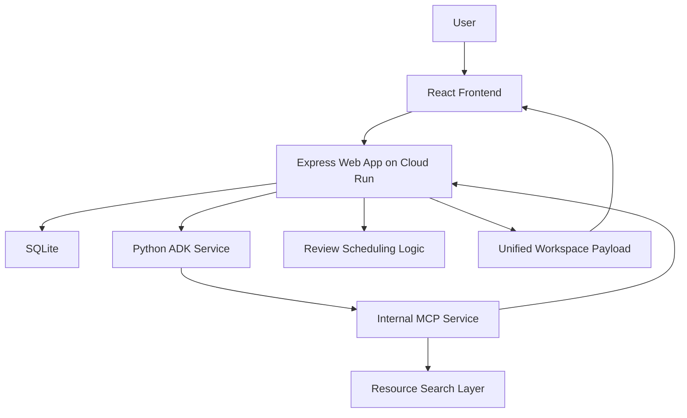

# Gen AI Academy Prototype Deck Content

This version reflects the current system state on commit `2b3f79b`, including the live Cloud Run demo deployment path with `web -> ADK -> MCP`, shared-token service authentication, and MCP-backed quick-action persistence.

Important positioning note: the deck template mentions `ADK`, `MCP`, and `AlloyDB AI`. This prototype now implements `ADK` and `MCP` in the deployed demo architecture, but persistence is still `SQLite` and AlloyDB/AlloyDB AI remain the next infrastructure step.

## Slide 1. Participant Details

**Participant Name:** `Fadly Zaki`

**Project Name:** `The Autodidact Project | Learning Progress Architect`

**Problem Statement:**  
Self-directed learners often know what they want to achieve, but struggle to convert broad goals into a realistic study plan, consistent day-to-day execution, and durable retention. Most tools help with planning, note-taking, or task tracking in isolation, which creates fragmented workflows and weak feedback loops.

## Slide 2. Brief About The Idea

Learning Progress Architect is an AI-guided learning workspace that transforms a vague learning goal into a structured roadmap, focused study sessions, contextual AI support, and adaptive review loops.

The system is designed for learners who need more than a to-do list. It supports the full study workflow:

- define a learning goal
- set a realistic weekly pace
- generate a roadmap
- attach or discover learning materials
- run a focused study session
- ask for in-session AI help when blocked
- capture reflection and confidence
- schedule reviews based on learning strength

The main idea is to reduce cognitive drag. Instead of forcing learners to build and manage their own study system, the product holds the structure for them.

## Slide 3. Solution Overview

### Paste-ready version

We approached the problem by designing around the real learning loop rather than around isolated productivity features.

The learner starts by describing a goal, current level, weekly time budget, preferred study style, and whether they already have learning materials. The system then generates a three-step roadmap and pairs each task with suggested resources so the learner can begin immediately.

During study sessions, the learner can trigger contextual AI quick actions such as "Explain Simply", "Give an Example", "Use an Analogy", and "I'm Confused". In the current architecture, the public web app routes those requests through an ADK service, which uses MCP tools to retrieve task context, reuse cached outputs, and persist new quick-action responses back into the learner workspace.

After the session, the learner records what they understood, where they got stuck, and how confident they feel. That confidence signal drives review scheduling, so difficult topics return sooner and stronger topics are spaced further out.

This creates practical value for self-directed learners, university students, and working professionals who need a calmer, more reliable path from intention to retained knowledge.

### Shorter slide version

Learning Progress Architect turns a vague goal into a complete learning workflow:

- AI-assisted roadmap generation
- resource-guided study setup
- guided study sessions
- ADK + MCP powered contextual AI support
- reflection and confidence capture
- adaptive review scheduling

## Slide 4. Opportunities / USP

### How different is it from existing ideas?

Most learning tools focus on only one layer of the problem:

- planning the curriculum
- storing notes or content
- tracking tasks
- delivering quizzes

Our solution is different because it connects planning, studying, clarification, reflection, and review into one continuous workflow. It is not just a planner and not just an AI chatbot. It is a study operating system designed to support the learner at the exact moments where friction usually causes drop-off.

### USP of the proposed solution

- Calm, workflow-native AI instead of a separate chat-first experience
- Personalized roadmap based on goal, level, pace, and study style
- Supports both learner-provided resources and system-suggested resources
- ADK + MCP architecture for contextual quick actions during live study sessions
- Cached AI outputs reduce repeated calls and improve continuity
- Confidence-based review timing turns reflection into retention
- One product flow from onboarding to progress tracking
- Cloud Run demo deployment already proves the architecture beyond localhost

## Slide 5. List Of Features Offered By The Solution

- Email and password authentication
- Guided onboarding for goal, level, weekly hours, target date, and learning style
- AI-assisted roadmap generation with deterministic fallback
- Support for learner-supplied resources such as docs, books, videos, and notes
- Suggested learning resources for each task
- Dashboard with next recommended task and active goal progress
- Roadmap page with task-by-task sequencing
- Session page with timer, objectives, and linked materials
- ADK-routed quick actions inside the session
- MCP-backed context retrieval and quick-action persistence
- Cached quick action responses for later reuse
- Comprehension capture after every study session
- Reflection and blocker logging
- Confidence-based review scheduling
- Reviews page for due and upcoming revision work
- Progress page with study time, streak, task completion, and confidence metrics
- Reflections page for reviewing prior session notes
- Bilingual interface support in English and Indonesian

## Slide 6. Process Flow Diagram / Use-Case Diagram

### Suggested content

```mermaid
flowchart LR
    A["Learner defines goal and study pace"] --> B["System generates roadmap"]
    B --> C["Tasks are enriched with resources"]
    C --> D["Learner starts a focused session"]
    D --> E["Learner triggers AI quick action"]
    E --> F["Web app calls ADK service"]
    F --> G["ADK uses MCP tools for context and persistence"]
    G --> H["Learner receives contextual help"]
    H --> I["Learner records reflection, blockers, confidence"]
    I --> J["System schedules next review"]
```

### Use-case explanation

- The learner creates a personal learning workspace
- The learner defines what to learn and how much time is available
- The system generates a structured roadmap
- The learner studies one task at a time
- If the learner gets stuck, the system provides contextual AI help
- ADK orchestrates the reasoning step and MCP retrieves or stores trusted workspace data
- The learner records understanding and blockers
- The system adapts review timing using confidence
- The learner tracks long-term progress and reflection history

## Slide 7. Wireframes / Mock Diagrams Of The Proposed Solution

### Recommended screen sequence

Use screenshots from the current prototype in this order:

- `Landing Page`
  Product value and calm learning philosophy
- `Onboarding`
  Goal, pace, study style, and resource mode setup
- `Dashboard`
  Current goal, next focus, plan summary, and progress signal
- `Session Page`
  Timer, study objective, resources, and quick action panel
- `Quick Action State`
  Generated explanation or analogy for the current task
- `Comprehension + Reviews`
  Reflection, blockers, confidence score, and review queue

### Caption text

The UI is designed to keep the learner focused on the next meaningful step. Instead of exposing too many decisions at once, each screen narrows the workflow and surfaces AI only when it directly supports learning.

## Slide 8. Architecture Diagram Of The Proposed Solution

### Suggested content

### Architecture explanation

- Frontend: React SPA for onboarding, dashboard, roadmap, sessions, reviews, progress, and reflections
- Public backend: Express app remains the only user-facing API and SPA host
- Agent layer: a Python ADK service handles workflow and study-coach orchestration
- Tool layer: MCP exposes trusted workspace operations such as task context lookup, cache lookup, and quick-action persistence
- Persistence: SQLite still stores users, tasks, sessions, resources, reviews, and quick-action outputs
- Runtime safety: the web app still keeps fallback behavior if the ADK path fails
- Deployment model: the demo stack is live on Cloud Run as `web -> ADK -> MCP`

## Slide 9. Technologies / Google Services Used In The Solution

### Paste-ready content

**Core technologies**

- React 19
- React Router 7
- Vite
- TypeScript
- Express
- SQLite with `better-sqlite3`
- Tailwind CSS 4

**Google and AI services**

- Cloud Run for the three-service demo deployment
- Google Cloud Build for image builds
- Python ADK service for agent orchestration
- MCP server for trusted tool execution
- Gemini-backed resource search path when configured

**Why this stack was chosen**

- React and Vite enable rapid iteration across a multi-step product experience
- Express keeps the public API simple and stable
- ADK creates a clean orchestration layer for agent behavior without changing the frontend contract
- MCP separates reasoning from trusted workspace reads and writes
- SQLite keeps the prototype easy to run end to end while the architecture evolves
- Cloud Run provides a realistic path from local prototype to cloud-hosted demo

### Honest Q&A positioning

This version already implements ADK and MCP in the deployed demo architecture. What is still not final is the data layer: persistence is still SQLite, and AlloyDB / AlloyDB AI are the next step for durable multi-user scale and richer retrieval.

## Slide 10. Snapshots Of The Prototype

### Recommended screenshots

- Landing page hero
- Onboarding flow
- Dashboard
- Study session screen
- Quick action response state
- Comprehension page
- Reviews page
- Progress page

### Suggested caption block

The prototype already demonstrates a complete learning loop:

- roadmap creation
- resource-guided study
- live contextual AI support
- ADK + MCP based quick-action orchestration
- reflection and confidence capture
- adaptive review scheduling
- progress visibility over time

This makes the solution more than a concept. It is already a functional end-to-end cloud demo.

## Slide 11. Closing / Future Roadmap

The current prototype proves that generative AI can be embedded into a learning workflow in a way that feels supportive, practical, and grounded in real study behavior.

### Next steps

- replace demo SQLite persistence with AlloyDB
- add retrieval and memory enrichment with AlloyDB AI
- support richer roadmap generation beyond a fixed three-task plan
- improve review intelligence with stronger spaced-repetition behavior
- strengthen service-to-service security from shared-token auth toward IAM-based identity
- expand from demo deployment to durable multi-user production architecture

### Closing line

Learning Progress Architect does not try to replace the learner. It reduces the invisible operational burden around learning so people can stay focused, recover faster when confused, and retain more of what they study.

## Screenshot Checklist

If you want to complete the deck quickly, capture screenshots from these routes:

- `/`
- `/onboarding`
- `/app`
- `/app/roadmap`
- `/app/session/:id`
- `/app/comprehension/:id`
- `/app/reviews`
- `/app/progress`
- `/app/reflections`

## Optional Presenter Note

If the judges ask what is new in the latest version of the prototype, the strongest answer is:

The product now uses a real multi-service AI path, not just in-process generation. The public web app routes learning assistance through an ADK service and MCP tool layer, which makes the prototype closer to a cloud-native agent system while keeping the user experience simple.
